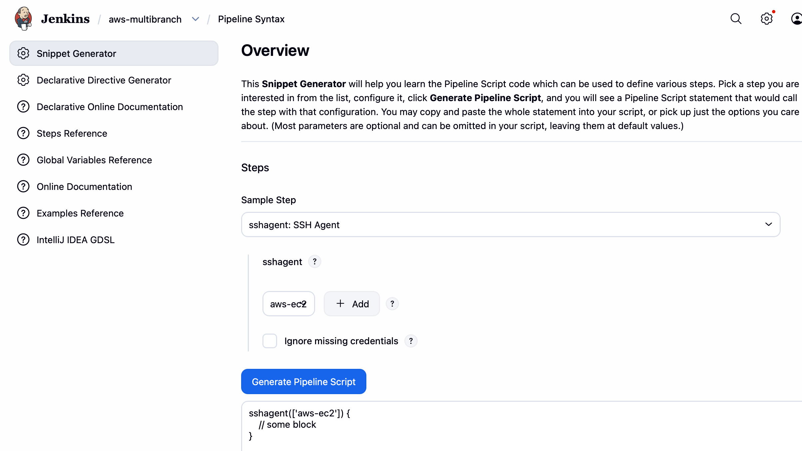
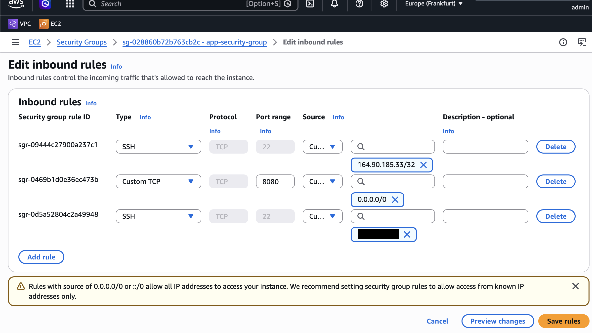

# Module 9 - AWS Services

This repository contains a demo project created as part of my **DevOps studies** in the **TechWorld with Nana – DevOps Bootcamp**.

https://www.techworld-with-nana.com/devops-bootcamp

***Demo Project:*** CD - Deploy Application from Jenkins Pipeline to EC2 Instance (automatically with docker)

***Technologies used:*** AWS, Jenkins, Docker, Linux, Git, Java, Maven, Docker Hub

***Project Description:*** 

- Prepare AWS EC2 Instance for deployment (Install Docker)
- Create ssh key credentials for EC2 server on Jenkins
- Extend the previous CI pipeline with deploy step to ssh into the remote EC2 instance and deploy newly built image from Jenkins server
- Configure security group on EC2 Instance to allow access to our web application

---

## Prerequisites

> **Complete the previous demo project first.**
> The EC2 instance must be launched with Docker installed.
> See [aws-module-9.1](https://github.com/explicit-logic/aws-module-9.1) for setup instructions.

> Authenticate with Docker Hub before proceeding:
> ```bash
> docker login
> ```

---

## Setup Steps

### 1. Install Jenkins Plugin

1. Open Jenkins and navigate to **Manage Jenkins** → **Plugins** → **Available plugins**
2. Search for and install **SSH Agent**
3. Restart Jenkins if prompted

---

### 2. Configure a Multibranch Pipeline

1. Go to **Dashboard** → **New Item**
2. Name it `aws-multibranch`, select **Multibranch Pipeline**, click **OK**

#### Branch Sources

- Click **Add source** → **Git**

| Field | Value |
|---|---|
| Credentials | `github` |
| Repository HTTPS URL | `https://github.com/explicit-logic/aws-module-9.2` |

- Click **Validate** to confirm access

#### Behaviors

Click **Add** and include:
- `Discover branches`
- `Discover pull requests from origin`

#### Build Configuration

| Field | Value |
|---|---|
| Script Path | `Jenkinsfile` |

#### Scan Multibranch Pipeline Triggers

3. Click **Save** — Jenkins will scan the repository and automatically create jobs for each branch

---

### 3. Create SSH Key Credentials for the EC2 Server

1. Navigate to the `aws-multibranch` pipeline → **Credentials** → **Add Credentials**

2. Fill in the following fields:

| Field | Value |
|---|---|
| Kind | `SSH Username with private key` |
| ID | `aws-ec2` |
| Username | `ec2-user` |
| Private Key | Paste the contents of your `.pem` file (see below) |

To copy the private key content, run:
```bash
cat ~/.ssh/app-key.pem
```

3. The generated `ssh-agent` code snippet will look like:

```groovy
sshagent(['aws-ec2']) {
  // your SSH commands here
}
```



> See the full deployment code in [`app/script.groovy`](./app/script.groovy) — `deployApp` function

---

### 4. Configure EC2 Security Group

Update the EC2 instance's inbound rules to allow traffic from Jenkins:

1. Go to **EC2** → **Security Groups** → select your instance's security group
2. Click **Edit inbound rules** → **Add rule**

| Type | Port | Source |
|---|---|---|
| SSH | 22 | `<Jenkins-IP>/32` |
| Custom TCP | 8080 | `0.0.0.0/0` |



---

### 5. Run the Pipeline

1. Trigger the pipeline job in Jenkins
2. Once complete, open your browser and navigate to:

```
http://<EC2_PUBLIC_IP>:8080
```


